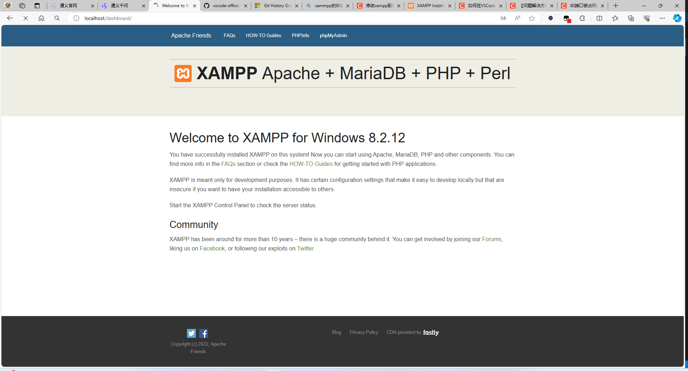
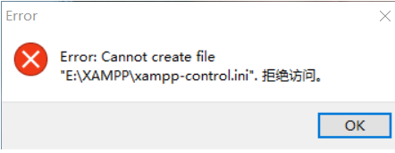
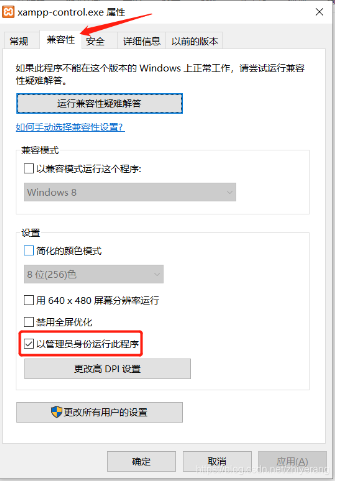
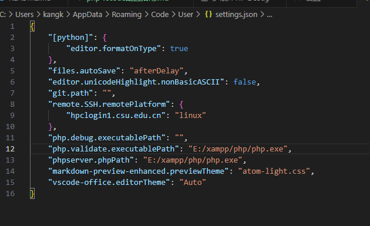

## XAMPP安装指南

php是需要搭配一些其他的软件才能够启动的，比如apache和mysql等，所以市面就有一些软件包，集成了php所需要的各种依赖环境，比如XAMPP等。XAMPP可以简单的开启相关的服务，并且XAMPP里面就有php的包，因此可以安装一个XAMPP以省略环境的配置。

下载链接：[XAMPP Installers and Downloads for Apache Friends](https://www.apachefriends.org/zh_cn/index.html)

下载完成之后直接安装就可以了。

安装之后启动Apache，apache用的端口是80端口，有些时候会产生端口冲突，因此就需要关掉相应的其他服务以便80端口释放出来，当然也可以修改apache的默认端口(我没这么干，所以没写教程)。

在cmd里面可以找到占用80端口的程序，然后根据对应的pid去在任务管理器里面找相应的服务，但是一般情况下这个pid可能是4，占用的服务是system，所以没办法关掉这个程序。那么可以按照下面的步骤执行，cmd控制台输入“regedit”回车，然后注册表编辑器会弹出，依次展开如下路径HKEY_LOCAL_MACHINE\SYSTEM\CurrentControlSet\Services\HTTP，然后点击HTTP，会看到有个Start文件，start的值可能是3，把他修改成4然后重启就可以了。(不知道是啥原理，反正就是可以了)。

打开apache服务之后，访问localhost:80应该是可以看到相应信息的,默认的web路径是xampp/htdocs/index.php



还可能碰到的一个问题是关闭xampp的时候提示下面这个东西，这时候可以把xampp-control.exe设置管理员权限



## PHP Debug插件安装+Vscode配置

php是有专门的debug插件的，名字叫做xdebug。

[Xdebug - Debugger and Profiler Tool for PHP](https://xdebug.org/)

Xdebug是分版本的，所以首先要知道自己的php是什么版本，简单的办法是通过 `phpinfo()` 这个函数来打印出结果

进入 `E:\xampp\htdocs\index.php `,输入以下代码

```php
<?php
	// if (!empty($_SERVER['HTTPS']) && ('on' == $_SERVER['HTTPS'])) {
	// 	$uri = 'https://';
	// } else {
	// 	$uri = 'http://';
	// }
	// $uri .= $_SERVER['HTTP_HOST'];
	// header('Location: '.$uri.'/dashboard/');
	// exit;
	phpinfo();
?>
```

然后，在localhost:80端口即可看到该相关信息，打开网页的源代码，将网页的全部内容复制，然后将其粘贴到 `https://xdebug.org/wizard 中即可分析出哪个版本是你应该下载的。`

下载，下载将其重命名为 `php_xdebug.dll`，然后放入到 `php/ext`中去，然后修改 `php.ini`文件，加入以下内容

```php
zend_extension = xdebug
xdebug.mode = debug
xdebug.start_with_request = yes
```

VSCode配置，需要下载两个插件分别是 `php debug`和 `php intelephense`和 `php server`,

打开vscode设置，搜索php，设置php文件的位置



总结：如果用vscode来配置环境的话，其实也可以暂时不用xampp这种包，可以直接下载php然后按照流程配置是一样的，因此php server这个插件就可以启动ph文件。
